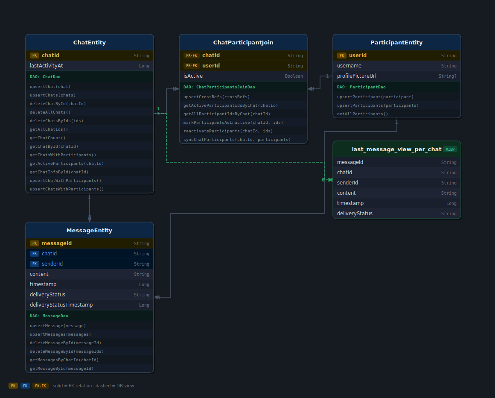

# KrossChat — Database Schema

## Entities

| Table | Columns |
|---|---|
| `ChatEntity` | `chatId` PK · `lastActivityAt` |
| `ParticipantEntity` | `userId` PK · `username` · `profilePictureUrl` |
| `MessageEntity` | `messageId` PK · `chatId` FK · `senderId` FK · `content` · `timestamp` · `deliveryStatus` · `deliveryStatusTimestamp` |
| `ChatParticipantJoin` | `chatId` PK+FK · `userId` PK+FK · `isActive` |

## Views

| View | Definition |
|---|---|
| `last_message_view_per_chat` | Most recent `MessageEntity` per `chatId` (by `MAX(timestamp)`) |

## Relationships

| From | To | Cardinality | Detail |
|---|---|---|---|
| `ChatEntity` | `MessageEntity` | one-to-many | `chatId` FK, cascade delete |
| `ChatEntity` | `ParticipantEntity` | many-to-many | via `ChatParticipantJoin` junction |
| `ParticipantEntity` | `MessageEntity` | one-to-many | `senderId` references `userId` |
| `ChatEntity` | `last_message_view_per_chat` | one-to-zero-or-one | DB view, most recent message per chat |